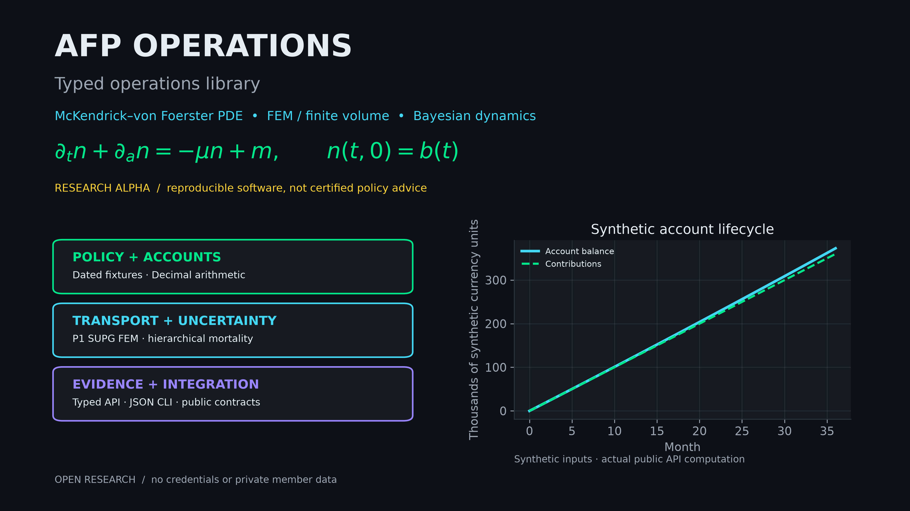

# afp-operations



**Alpha research package** for AFP/pension operations kernels: explicit dated policy fixtures, Decimal account arithmetic, finite-volume age transport, a scikit-fem adapter, and optional NumPyro smoke inference.

It is not AFP administration software, banking/custody infrastructure, legal advice, actuarial certification, or an official current-law Chile rules engine.

**Public project:** [Pension Systems — PDE & Bayesian Research](https://github.com/users/googa27/projects/36).

Companion workbench: [`pension-systems-lab`](https://github.com/googa27/pension-systems-lab). Public home: <https://github.com/googa27/afp-operations>.

## What is implemented now

| Capability | Status | Notes |
|---|---:|---|
| Importable package `afp_operations` | Implemented | Public typed API declared in `src/afp_operations/__init__.py`. |
| CLI `afp-operations capabilities` | Implemented | Honest feature manifest, including planned-unavailable live transfer/legal-rule claims. |
| CLI `afp-operations demo` | Implemented | Deterministic JSON lifecycle using synthetic member/account data. |
| Decimal contribution/account arithmetic | Implemented | Cent rounding, fees, reconciliation, annuity-factor quote. |
| Finite-volume transport | Implemented | Conservative age transport with inflow, mortality, outflow, and residual report. |
| scikit-fem adapter | Implemented | Genuine P1 SUPG implicit solve; manufactured-solution and refinement tests, honest residuals. |
| NumPyro Bayesian inference | Optional smoke | Actual country/year/group partial pooling and random-walk dynamics; real posterior draws propagated into FV; not calibrated. |
| International/current-law coverage | Roadmap | Requires validated jurisdiction-specific legal review and data contracts. |

## Quickstart

The package is **not published on PyPI**. Clone and run with `uv`:

```bash
git clone https://github.com/googa27/afp-operations.git
cd afp-operations
uv sync --all-extras --dev
uv run --no-sync afp-operations capabilities
uv run --no-sync afp-operations demo
uv run --no-sync afp-operations bayes-smoke
```

## Verification commands

```bash
uv run --no-sync pytest
uv run --no-sync ruff check .
uv run --no-sync ruff format --check .
uv run --no-sync mypy
uv build
uv run --no-sync python scripts/publication_guard.py --mode git
python scripts/scan_publication.py
```

## Data, licensing, and private boundary

- Demo values are synthetic calculations labelled as such; they are not member data.
- No raw `.xlsx`/`.pdf`, database dumps, credentials, portal exports, agent histories, or private repository details belong in this public package.
- Source/data providers, formulation providers, numerical backends, and artifact renderers are documented as role contracts rather than private integrations.
- Regulations are dated research context; this package deliberately avoids hard-coded legal-currentness claims.

## Documentation

- [API](docs/API.md)
- [Theory](docs/THEORY.md)
- [Architecture](docs/ARCHITECTURE.md)
- [Architecture source of truth](docs/ARCHITECTURE.yaml)
- [Research notes](docs/RESEARCH.md)
- [Chile regulation context](docs/REGULATION.md)
- [Ecosystem boundary](docs/ECOSYSTEM.md)
- [Roadmap](docs/ROADMAP.md)

## License

MIT. See [LICENSE](LICENSE).
